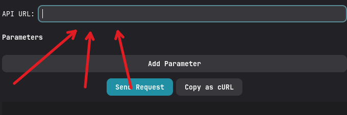
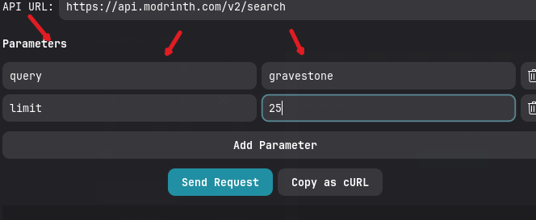
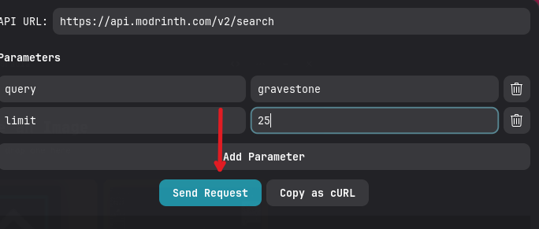

# dependencies
- [python](https://www.python.org/downloads/)
- pygobject (for gui)
- pyperclip (for copying curl command)
# how to install dependencies
- run `pip install pygobject pyperclip` (with python installed)
# how to run
- run `python api_client.py` or just run the "api_client" file
# how to use
- add api url 
- add params (if wanted) 
- send request 
